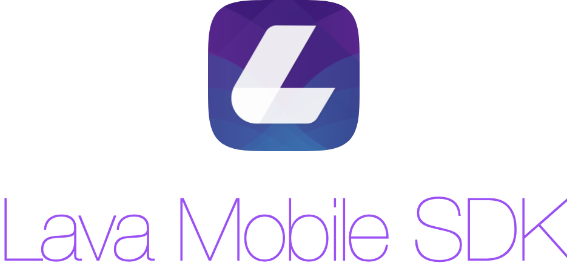

    

LavaMobileSDK for iOS is the client libary to integrate your mobile apps with Lava Platform.

- [Features](#features)
- [Requirements](#requirements)
- [Installation](#installation)
  - [Install LAVA SDK iOS with Swift Package Manager](#install-lava-sdk-ios-with-swift-package-manager)
  - [Install LAVA SDK iOS manually](#install-lava-sdk-ios-manually)
- [Help](#help)

## Features

- Handle push notification from LAVA Platform.
- Message Inbox.
- Membership Pass.
- Deep Links.
- Track Events.

## Requirements

1. Xcode 13.2
2. Swift 5.5.2 and later

## Installation
### Install LAVA SDK iOS with Swift Package Manager

1. In Xcode, select File > Add Packages...

    

2. In the search text field, enter `https://github.com/lavaai/LavaMobileSDK-iOS`.

    

3. Check for appropriate version and click `Add Package`.

    

### Install LAVA SDK iOS manually
1. Clone the repository or download the `LavaSDK.xcframework.zip`.
2. Extract the `LavaSDK.xcframework.zip`.
3. Drag the `LavaSDK.xcframework` folder to your project.

## Help
Please contact LAVA Support in case you need help.