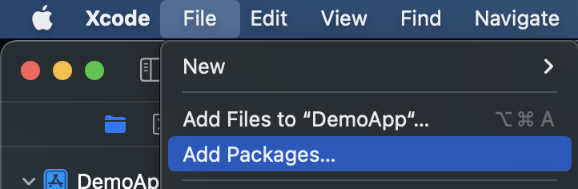
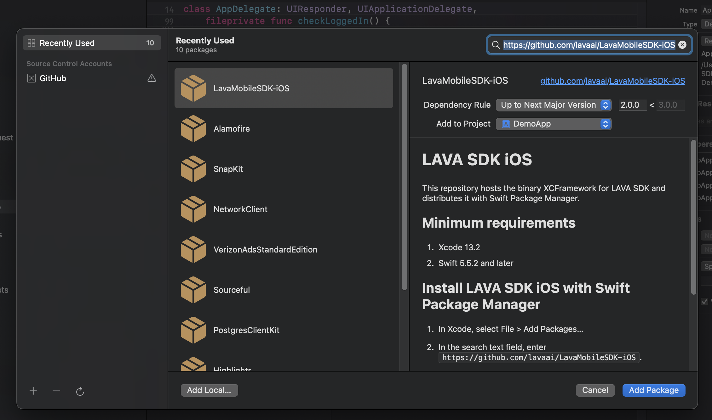
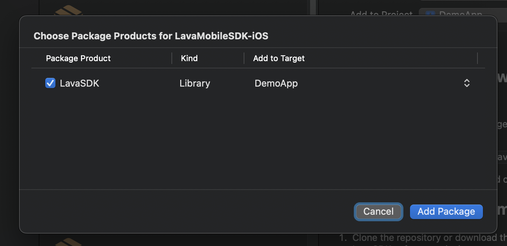
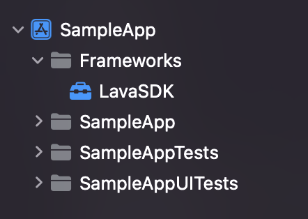
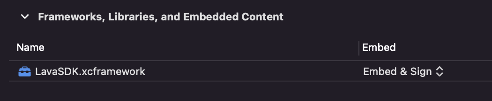

# Getting started

[Integration guide](README.md)

## Overview

The LAVA Mobile SDK is part of the LAVA real-time engagement platform. It supports:

- Personal information consent
- Push notifications from the LAVA platform
- Message inbox
- Membership pass
- Deep links
- Track events

## Requirements

The LAVA iOS SDK is available as a `LavaSDK.xcframework` file.

- Xcode 13.0 and above
- iOS 13.0 and above
- Swift 5

## Installation

Install the SDK with Swift Package Manager, or manually with the provided `LavaSDK.xcframework`.

### Install with Swift Package Manager

1. In Xcode, select **File** > **Add Packages...**

<p align="center">
    
</p>

2. In the search field, enter `https://github.com/lavaai/LavaMobileSDK-iOS`.

<p align="center">
    
</p>

3. Check the version and click **Add Package**.

<p align="center">
    
</p>

### Install manually

1. Clone [LavaMobileSDK-iOS](https://github.com/lavaai/LavaMobileSDK-iOS) or download `LavaSDK.xcframework.zip`.
2. Extract `LavaSDK.xcframework.zip`.
3. Drag `LavaSDK.xcframework` into your project. You can create a Frameworks group for it.

<p align="center">
    
</p>

Set `LavaSDK.xcframework` to **Embed & Sign** under **Frameworks, Libraries, and Embedded Content**.

<p align="center">
    
</p>

## Configure and initialize

1. Import LavaSDK in `AppDelegate`:

```swift
import LavaSDK
```

2. Initialize the SDK with the app key and client ID provided by LAVA:

```swift
func application(_ application: UIApplication, didFinishLaunchingWithOptions launchOptions: [UIApplication.LaunchOptionsKey: Any]?) -> Bool {
    // ...
    Lava.initialize(
        appKey: "ENTER YOUR APP-KEY",
        clientId: "ENTER YOUR CLIENT-ID",
        logLevel: .warn
    )
    // ...
}
```

The optional `logLevel` parameter sets the SDK debug logging level.

> **Note**
>
> This `initialize()` call assumes full consent. To customize the consent list, see [Personal information consent](consent.md).

3. Below `Lava.initialize()`, call `Lava.shared.start()` so the SDK can start authentication:

```swift
func application(_ application: UIApplication, didFinishLaunchingWithOptions launchOptions: [UIApplication.LaunchOptionsKey: Any]?) -> Bool {
    // ...
    Lava.initialize(
        appKey: "ENTER YOUR APP-KEY",
        clientId: "ENTER YOUR CLIENT-ID"
    )
    Lava.shared.start()
    // ...
}
```

The full parameter list is in [Initialization](initialization.md).

## General usage

The main SDK APIs are on the shared `Lava` instance. For example:

```swift
Lava.shared.getDebugInfo()
```

Later sections use `OnSuccess`, `OnSuccessWithData`, and `OnError`. These callbacks run on the main thread:

```swift
public typealias OnSuccess = () -> Void
public typealias OnSuccessWithData<T: Codable> = (T) -> Void
public typealias OnError = (Error) -> Void
```

Most LAVA iOS SDK calls are asynchronous.

## Error

`APIError` lists SDK errors:

```swift
public enum APIError: Error {
    case unauthenticated
    case invalidInput
    case invalidURL
    case networkError(error: Error)
    case serverError(code: Int)
    case contentTypeError
    case responseConversionError
    case requestConversionError
    case unknownError
}
```

---

[Integration guide](README.md) · [Previous: Change log](changelog.md) · [Next: Initialization](initialization.md)
