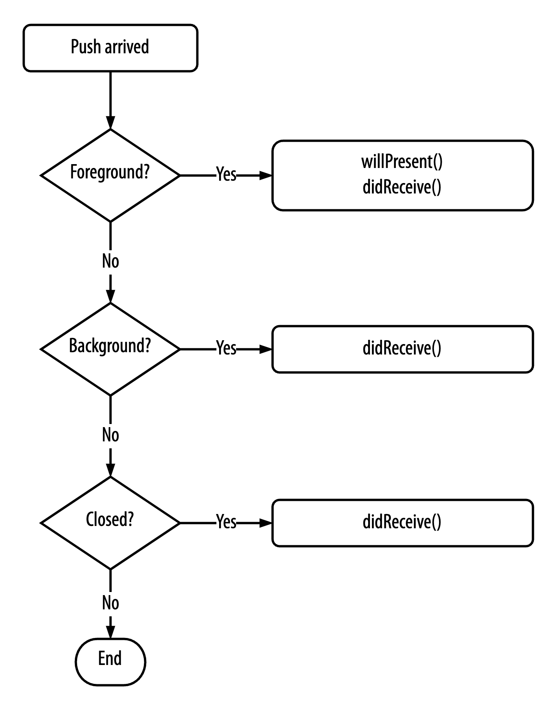

# Push notifications

[Integration guide](README.md)

## Register a notification token

| Personal information consent | Collected data |
| --- | --- |
| Strictly Necessary, Functional | Access token, secure member token, notification token |

Register the app for LAVA push notifications from `AppDelegate`:

```swift
public func setNotificationToken(deviceToken: Data)
```

**Usage**

```swift
func application(
    _ application: UIApplication,
    didRegisterForRemoteNotificationsWithDeviceToken deviceToken: Data
) {
    Lava.shared.setNotificationToken(deviceToken: deviceToken)
}
```

## Handle incoming push notifications

| Personal information consent | Collected data |
| --- | --- |
| Strictly Necessary, Functional | Access token, secure member token, notification token |

```swift
public func handleNotification(userInfo: [AnyHashable: Any]) -> Bool
```

The app must cover three states for notifications to appear:

1. **Foreground:** at least one screen of the app is active.
2. **Background:** no screen is active, but the process is still running.
3. **Closed:** the app has been terminated.

<p align="center">
    
</p>

Call `handleNotification()` in two places:

1. `userNotificationCenter(_:willPresent:withCompletionHandler:)`, for a notification while the app is in the foreground.
2. `userNotificationCenter(_:didReceive:withCompletionHandler:)`, for a notification while the app is in the background or closed.

The SDK only handles push notifications that come from LAVA. The return value says whether the SDK consumed the notification. If it is `false`, the app should handle it.

**Usage**

```swift
func userNotificationCenter(
    _ center: UNUserNotificationCenter,
    didReceive response: UNNotificationResponse,
    withCompletionHandler completionHandler: @escaping () -> Void
) {
    let userInfo = response.notification.request.content.userInfo

    let handled = Lava.shared.handleNotification(userInfo: userInfo)

    if handled == false {
        // Handle app notifications
    }
}

func userNotificationCenter(
    _ center: UNUserNotificationCenter,
    willPresent notification: UNNotification,
    withCompletionHandler completionHandler: @escaping (UNNotificationPresentationOptions) -> Void
) {
    completionHandler([.alert, .badge, .sound])

    let userInfo = notification.request.content.userInfo

    let handled = Lava.shared.handleNotification(userInfo: userInfo)

    if handled == false {
        // Handle app notifications
    }
}
```

## Check if a push notification can be handled by Lava

| Personal information consent | Collected data |
| --- | --- |
| Strictly Necessary | Access token |

Use `canHandlePushNotification` when the app, or another library, handles some notifications itself.

```swift
public func canHandlePushNotification(userInfo: [AnyHashable: Any]) -> Bool
```

**Usage**

```swift
func userNotificationCenter(
    _ center: UNUserNotificationCenter,
    willPresent notification: UNNotification,
    withCompletionHandler completionHandler: @escaping (UNNotificationPresentationOptions) -> Void
) {
    let userInfo = notification.request.content.userInfo

    if Lava.shared.canHandlePushNotification(userInfo: userInfo) {
        // Notification is from Lava
    } else {
        // Notification is not from Lava
    }
}
```

## Customize the push notification UI

| Personal information consent | Collected data |
| --- | --- |
| Strictly Necessary | Access token |

The SDK uses a basic notification style unless you set your own:

```swift
public func setCustomStyle(customStyle: Style)
```

**Usage**

```swift
let customStyle = Style()
    .setTitleFont(UIFont.systemFont(ofSize: 24))
    .setContentFont(UIFont.systemFont(ofSize: 14))
    .setBackgroundColor(UIColor.white)
    .setTitleTextColor(UIColor.black)
    .setContentTextColor(UIColor.darkGray)
    .setCloseImage(UIImage(named: "test_close"))

Lava.shared.setCustomStyle(customStyle: customStyle)
```

---

[Integration guide](README.md) · [Previous: Authentication and profile](authentication.md) · [Next: Message inbox](message-inbox.md)
